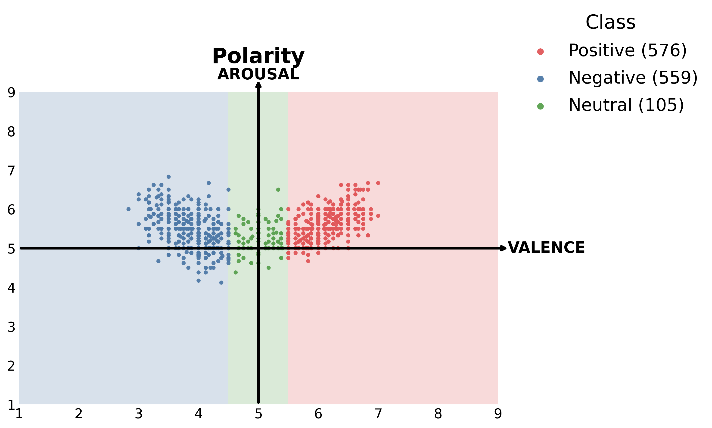
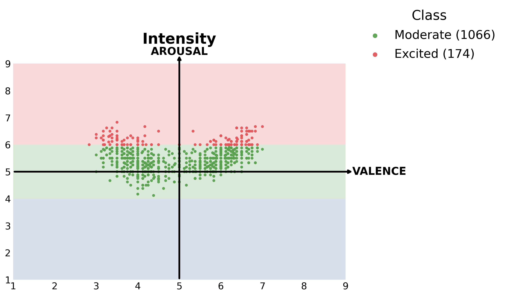
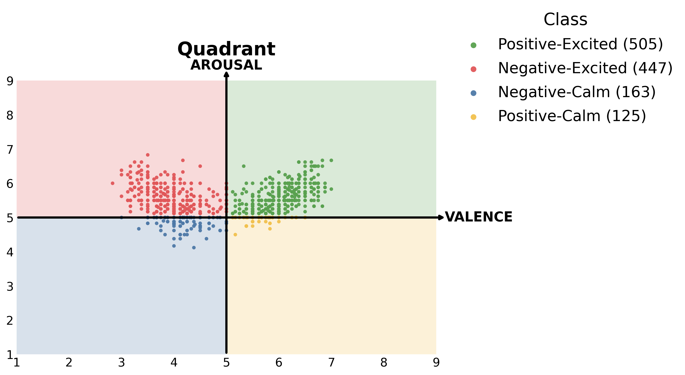
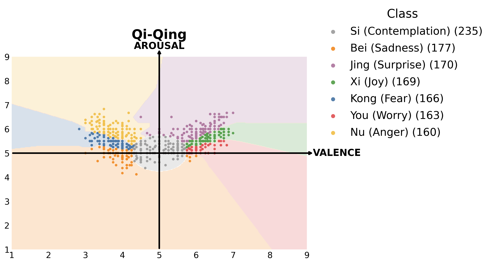

[繁體中文](README_ZH.md) | [English](README.md)

# CYUT at SemEval-2026 Task 3: Multi-Task Dimensional Aspect Sentiment Regression by Fine-tuning Pretrained Models in a VA Space with Seven Emotions Directional Prototypes

This repository contains the official implementation of our system for **SemEval-2026 Task 3 Track B**. We propose a framework that combines geometric information with Multi-Task Learning (MTL) to improve the stability of Valence-Arousal (VA) continuous score regression in multilingual and cross-domain contexts.

## 🌟 Core Features
* **Geometric Supervision**: Automatically derives polarity, intensity, quadrant, and "Seven Emotions (Qi-Qing)" directional prototype labels based on a polar coordinate system directly from Gold VA annotations, requiring no additional human annotation.
* **Distribution-aware Partitioning**: Dynamically adjusts emotion sectors according to the data distribution of different languages to ensure label balance for auxiliary tasks.
* **Multi-Model Support & PEFT**: Integrates both encoder-based (XLM-R) and decoder-based (Qwen2, Ministral) models, utilizing LoRA for parameter-efficient fine-tuning.

## 📊 Geometric Auxiliary Tasks Distribution
This framework regularizes the model through the following four geometric auxiliary tasks, which act as semantic anchors in the VA space:

| 情緒極性 (Polarity) | 情緒強度 (Intensity) |
| :---: | :---: |
|  |  |
| **情緒象限 (Quadrant)** | **七情定向原型 (Qi-Qing)** |
|  |  |

## ⚙️ Ablation Study Switch
To facilitate academic reproduction, we designed an "auxiliary task switch" in our training scripts. You can easily reproduce the ablation study results reported in our paper by modifying the `ENABLED_AUX_TASKS` set in the training scripts under the `models/` directory:

> **Settings:** Please modify the following variables in the script (Location: `models/encoder_xlmr/XLM_train.py` or `models/decoder_qwen/qwen_lora_train.py`)

```python
    ENABLED_AUX_TASKS = {
        "Polarity Classification", 
        "Emotion Quadrant", 
        "Seven Emotions Classification"   # Example: Ablate "Intensity Classification"
    }
```

## 📂 Project Structure
```text
CYUT-SemEval2026-Task3/
├── data/                          # Data storage
│   ├── raw/                       # Raw track_b/train & test data
│   ├── processed/                 # Annotated geometric data
│   ├── sft/                       # JSON format for fine-tuning
│   └── prompts/                   # Prompt format for inference
├── score/
│   ├── metrics_subtask_1_2_3.py   # Official scoring script
├── scripts/                       # Core logic scripts
│   ├── 01_gen_qiqing_labels.py    # Generate dynamic labels
│   ├── 02_prepare_sft_data.py     # Construct multi-task data
│   ├── 03_prepare_test_prompts.py # Format test prompts
│   └── 04_merge_predictions.py    # Align prediction results
├── models/                        # Model architectures and training
│   ├── encoder_xlmr/              # XLM-R training and inference
│   ├── decoder_qwen/              # Qwen2 training and inference
│   └── decoder_ministral/         # Ministral training and inference
├── results/                       # Output prediction results
├── README.md                      # This documentation
└── requirements.txt               # Required packages list
```

## 💻 Environment Setup
Please ensure Python is installed in your environment, then run the following command to install the required dependencies for this project:

```bash
pip install -r requirements.txt
```

## 🛠️ Pipeline Overview

### 1. Data Preprocessing & Annotation
Execute the following scripts to generate dynamic labels and prepare fine-tuning data:
* **Generate Qi-Qing Labels**: `python scripts/01_gen_qiqing_labels.py`
* **Construct Multi-task SFT Data**: `python scripts/02_prepare_sft_data.py`
* **Prepare Test Prompts**: `python scripts/03_prepare_test_prompts.py`

### 2. Model Training & Ablation Studies
You can run the following commands to start training for different model backbones:
* **Encoder-based**: `python models/encoder_xlmr/XLM_train.py`
* **Decoder-based (Qwen)**: `python models/decoder_qwen/qwen_lora_train.py`
* **Decoder-based (Ministral)**: `python models/decoder_ministral/ministral_lora_train.py`

### 3. Inference & Result Merging
After inference is complete, use `scripts/04_merge_predictions.py` to re-align the scattered Aspect prediction results back into the official JSONL format required by the task.

---

## 📊 Experimental Results

### 1. Dataset Statistics
| Language | Domain | Train | Dev | Test | Total |
| :--- | :--- | :---: | :---: | :---: | :---: |
| English (ENG) | Environment | 922 | 200 | 1020 | 2142 |
| Chinese (ZHO) | Environment | 700 | 100 | 600 | 1400 |
| German (DEU) | Politics | 683 | 34 | 263 | 980 |
| Nigerian Pidgin (PCM) | Politics | 1049 | 119 | 331 | 1499 |
| Swahili (SWA) | Politics | 1375 | 123 | 266 | 1764 |

### 2. Ablation results on the dev set across five languages

| Backbone | Setting | VA | Polarity | Intensity | Quadrant | Qiqing | ENG | DEU | ZHO | PCM | SWA | **Avg**↓ |
| :--- | :--- | :---: | :---: | :---: | :---: | :---: | :---: | :---: | :---: | :---: | :---: | :---: |
| **Qwen2** | No-MTL | ✅ | - | - | - | - | 1.9231 | 1.4435 | 0.5826 | 1.5095 | 2.2110 | 1.5339 |
| **Qwen2** | w/o Polarity | ✅ | - | ✅ | ✅ | ✅ | 1.8640 | 1.5119 | 0.5514 | 1.5177 | 2.3078 | 1.5506 |
| **Qwen2** | w/o Intensity | ✅ | ✅ | - | ✅ | ✅ | 1.8936 | 1.4965 | 0.5533 | 1.5929 | 2.4846 | 1.6042 |
| **Qwen2** | w/o Quadrant | ✅ | ✅ | ✅ | - | ✅ | 1.9090 | 1.4986 | 0.5608 | 1.5521 | 2.3671 | 1.5775 |
| **Qwen2** | w/o Qiqing | ✅ | ✅ | ✅ | ✅ | - | **1.7961** | **1.4349** | 0.5424 | 1.5728 | 2.3846 | 1.5462 |
| **Qwen2** | **MTL (5-task)** | ✅ | ✅ | ✅ | ✅ | ✅ | 1.8912 | 1.5384 | **0.5236** | **1.4481** | **2.1908** | **1.5184** |
| | | | | | | | | | | | | |
| **XLM-R** | No-MTL | ✅ | - | - | - | - | 2.1337 | 1.5711 | 0.7227 | 1.7855 | 2.4567 | 1.7339 |
| **XLM-R** | **w/o Polarity** | ✅ | - | ✅ | ✅ | ✅ | **2.0761** | 1.7607 | 0.7119 | **1.1236** | 2.0918 | **1.5528** |
| **XLM-R** | w/o Intensity | ✅ | ✅ | - | ✅ | ✅ | 2.1721 | 1.8826 | 0.9069 | 1.3583 | 2.1049 | 1.6849 |
| **XLM-R** | w/o Quadrant | ✅ | ✅ | ✅ | - | ✅ | 2.0945 | 1.8178 | 0.6814 | 1.6729 | 2.1796 | 1.6892 |
| **XLM-R** | w/o Qiqing | ✅ | ✅ | ✅ | ✅ | - | 2.2338 | **1.5083** | **0.6442** | 1.4426 | **1.9784** | 1.5615 |
| **XLM-R** | MTL (5-task) | ✅ | ✅ | ✅ | ✅ | ✅ | 2.1217 | 1.7988 | 0.7166 | 1.2819 | 1.9907 | 1.5820 |
| | | | | | | | | | | | | |
| **Ministral**| No-MTL | ✅ | - | - | - | - | 1.9414 | 1.4506 | 0.7752 | 1.3391 | 2.3303 | 1.5673 |
| **Ministral**| w/o Polarity | ✅ | - | ✅ | ✅ | ✅ | 1.8331 | **1.3765** | 0.6332 | 1.1642 | 2.0881 | 1.4190 |
| **Ministral**| w/o Intensity | ✅ | ✅ | - | ✅ | ✅ | 1.8187 | 1.5518 | 0.6270 | 1.2497 | 2.2231 | 1.4941 |
| **Ministral**| **w/o Quadrant** | ✅ | ✅ | ✅ | - | ✅ | **1.7568** | 1.4230 | 0.6498 | 1.0811 | **2.0642** | **1.3950** |
| **Ministral**| w/o Qiqing | ✅ | ✅ | ✅ | ✅ | - | 1.8011 | 1.6342 | **0.6263** | 0.9737 | 2.1507 | 1.4372 |
| **Ministral**| MTL (5-task) | ✅ | ✅ | ✅ | ✅ | ✅ | 1.7601 | 1.5471 | 0.6767 | **0.9645** | 2.1284 | 1.4154 |

### 3. Test set results across five languages
*Evaluated using the 5-task setting (VA+Polarity+Intensity+Quadrant+Qiqing).*

| Backbone | ENG | DEU | ZHO | PCM | SWA | **Avg**↓ |
| :--- | :---: | :---: | :---: | :---: | :---: | :---: |
| **Qwen2** | **1.6331** | **1.4827** | 0.6771 | **1.1024** | 2.1042 | **1.3999** |
| **XLM-R** | 2.1330 | 1.6592 | 0.7056 | 1.7634 | **2.0446** | 1.6612 |
| **Ministral** | 1.7793 | 1.5153 | **0.6631** | 1.1851 | 2.2659 | 1.4817 |

---

## 🎓 Citation
If you use this code or framework in your research, please cite our paper:
> Shih-Hung Wu, Xian-yan Chen, and Yi-Min Jian. 2026. "CYUT at SemEval-2026 Task 3: Multi-Task Dimensional Aspect Sentiment Regression by Fine-tuning Pretrained Models in a VA Space with Seven Emotions Directional Prototypes."

## 📜 License
This project is licensed under the **MIT License**.