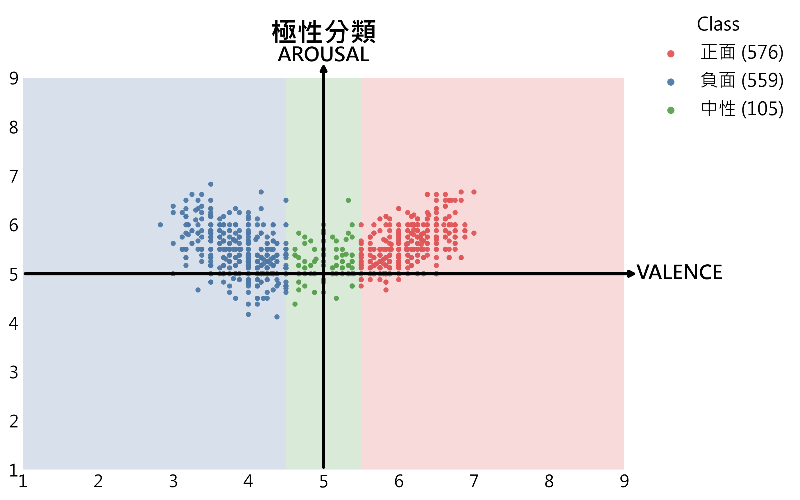
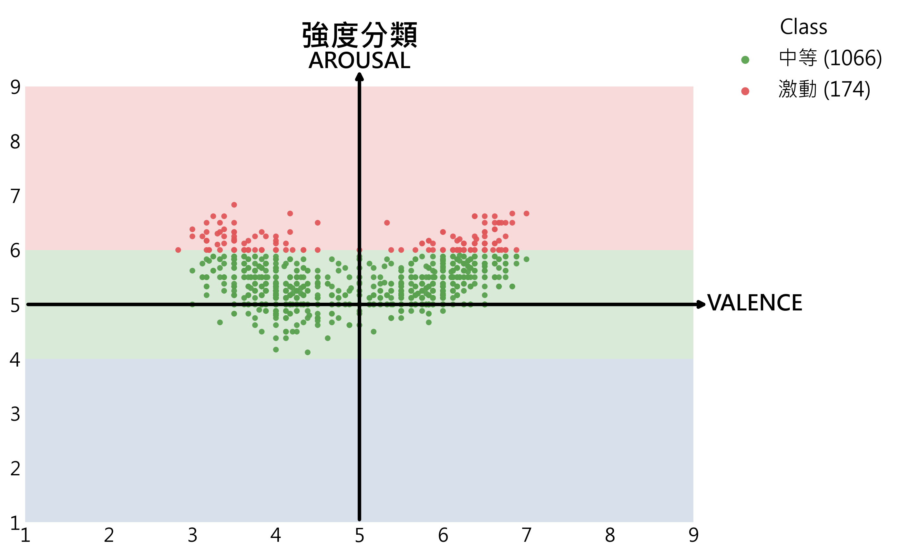
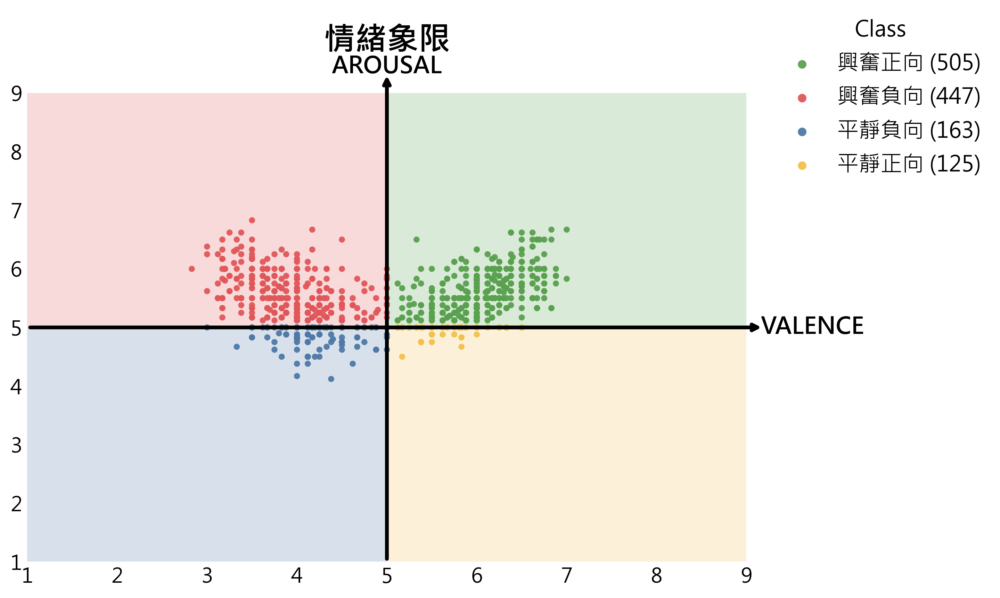
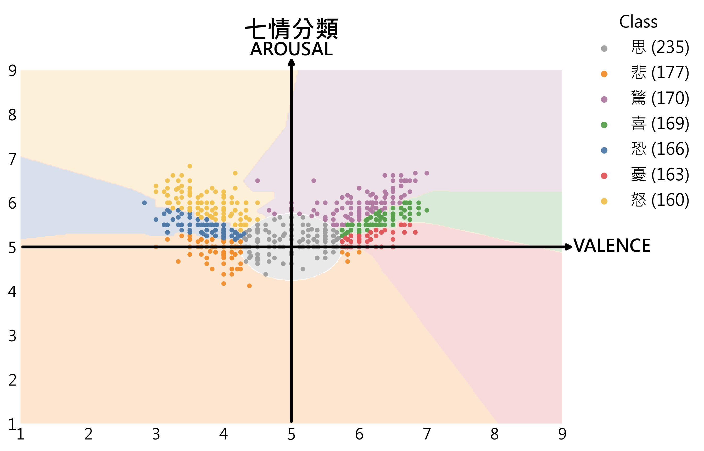

[繁體中文](README_ZH.md) | [English](README.md)

# CYUT at SemEval-2026 Task 3: 基於幾何知覺多任務學習與七情定向原型之維度層面情感回歸

本項目為 **SemEval-2026 Task 3 Track B** 的系統實現。我們提出了一種結合幾何資訊與多任務學習（Multi-Task Learning, MTL）的框架，旨在提升多語言與跨領域情境下 Valence-Arousal (VA) 連續分數回歸的穩定性。

## 🌟 核心特點
* **幾何輔助監督 (Geometric Supervision)**：自動從 Gold VA 標註中推導極性、強度、象限，以及基於極座標系統的「七情 (Seven Emotions)」定向原型標籤，無需額外人工標註。
* **分佈感知定向切分 (Distribution-aware Partitioning)**：針對不同語言的資料分佈，動態調整情緒扇區，確保輔助任務標籤的平衡性。
* **多模型支援與 PEFT**：整合了編碼器模型 (XLM-R) 與解碼器模型 (Qwen2, Ministral)，並使用 LoRA 進行參數高效微調。

## 📊 幾何輔助任務分佈
本框架透過以下四種幾何輔助任務對模型進行正則化，這些任務充當 VA 空間中的語義錨點：

| 情緒極性 (Polarity) | 情緒強度 (Intensity) |
| :---: | :---: |
|  |  |
| **情緒象限 (Quadrant)** | **七情定向原型 (Qi-Qing)** |
|  |  |

## ⚙️ 消融實驗開關 (Ablation Study Switch)
為了便於學術重現，我們在訓練腳本中設計了「輔助任務開關」。您可以在 `models/` 目錄下的訓練腳本中修改 `ENABLED_AUX_TASKS` 集合，即可輕鬆重現論文中的消融實驗結果：

> **設定方式：** 請在腳本中修改以下變數（位置：`models/encoder_xlmr/XLM_train.py` 或 `models/decoder_qwen/qwen_lora_train.py`）

```python
    ENABLED_AUX_TASKS = {
        "極性分類", 
        "情緒象限", 
        "七情分類"   # 範例：消融掉「強度分類」
    }
```

## 📂 專案結構
```text
CYUT-SemEval2026-Task3/
├── data/                          # 資料存放區
│   ├── raw/                       # 原始 track_b/train & test 資料
│   ├── processed/                 # 標註後的資料
│   ├── sft/                       # 微調用的 JSON 格式
│   └── prompts/                   # 推理用的 Prompt 格式
├── score/
│   ├── metrics_subtask_1_2_3.py   # 官方評分程式
├── scripts/                       # 核心邏輯
│   ├── 01_gen_qiqing_labels.py    # 生成動態標籤
│   ├── 02_prepare_sft_data.py     # 構建多任務數據
│   ├── 03_prepare_test_prompts.py # 格式化測試 Prompt
│   └── 04_merge_predictions.py    # 結果對齊
├── models/                        # 模型架構與訓練
│   ├── encoder_xlmr/              # XLM-R 訓練與推理
│   ├── decoder_qwen/              # Qwen2 訓練與推理
│   └── decoder_ministral/         # Ministral 訓練與推理
├── results/                       # 存放預測結果
├── README.md                      # 本說明文件
└── requirements.txt               # 必要套件清單
```

## 💻 環境設定 (Environment Setup)
請先確保您的環境中已安裝 Python，接著執行以下指令安裝本專案所需的依賴套件：

```bash
pip install -r requirements.txt
```
## 🛠️ 流水線 (Pipeline) 說明

### 1. 數據預處理與標註
執行以下腳本生成動態標籤並準備微調數據：
* **生成七情標籤**：`python scripts/01_gen_qiqing_labels.py`
* **建構多任務 SFT 數據**：`python scripts/02_prepare_sft_data.py`
* **測試 Prompts 準備**：`python scripts/03_prepare_test_prompts.py`

### 2. 模型訓練與消融實驗
您可以執行以下指令啟動不同模型基座的訓練：
* **Encoder-based**: `python models/encoder_xlmr/XLM_train.py`
* **Decoder-based (Qwen)**: `python models/decoder_qwen/qwen_lora_train.py`
* **Decoder-based (Ministral)**: `python models/decoder_ministral/ministral_lora_train.py`

### 3. 推理與結果合併
推理完成後，使用 `scripts/04_merge_predictions.py` 將分散的 Aspect 預測結果重新對齊至官方要求的 JSONL 格式。

---

## 📊 實驗結果 (Experimental Results)

### 1. 數據集統計 (Dataset Statistics)
| 語言 | 領域 | 訓練集 | 開發集 | 測試集 | 總計 |
| :--- | :--- | :---: | :---: | :---: | :---: |
| 英語 (ENG) | 環境保護 | 922 | 200 | 1020 | 2142 |
| 中語 (ZHO) | 環境保護 | 700 | 100 | 600 | 1400 |
| 德語 (DEU) | 政治 | 683 | 34 | 263 | 980 |
| 奈及利亞皮欽語 (PCM) | 政治 | 1049 | 119 | 331 | 1499 |
| 斯瓦希里語 (SWA) | 政治 | 1375 | 123 | 266 | 1764 |

### 2. 消融實驗分析 (Ablation results on the dev set across five languages)

| Backbone | Setting | VA | Polarity | Intensity | Quadrant | Qiqing | ENG | DEU | ZHO | PCM | SWA | **Avg**↓ |
| :--- | :--- | :---: | :---: | :---: | :---: | :---: | :---: | :---: | :---: | :---: | :---: | :---: |
| **Qwen2** | No-MTL | ✅ | - | - | - | - | 1.9231 | 1.4435 | 0.5826 | 1.5095 | 2.2110 | 1.5339 |
| **Qwen2** | w/o Polarity | ✅ | - | ✅ | ✅ | ✅ | 1.8640 | 1.5119 | 0.5514 | 1.5177 | 2.3078 | 1.5506 |
| **Qwen2** | w/o Intensity | ✅ | ✅ | - | ✅ | ✅ | 1.8936 | 1.4965 | 0.5533 | 1.5929 | 2.4846 | 1.6042 |
| **Qwen2** | w/o Quadrant | ✅ | ✅ | ✅ | - | ✅ | 1.9090 | 1.4986 | 0.5608 | 1.5521 | 2.3671 | 1.5775 |
| **Qwen2** | w/o Qiqing | ✅ | ✅ | ✅ | ✅ | - | **1.7961** | **1.4349** | 0.5424 | 1.5728 | 2.3846 | 1.5462 |
| **Qwen2** | **MTL (5-task)** | ✅ | ✅ | ✅ | ✅ | ✅ | 1.8912 | 1.5384 | **0.5236** | **1.4481** | **2.1908** | **1.5184** |
| | | | | | | | | | | | | |
| **XLM-R** | No-MTL | ✅ | - | - | - | - | 2.1337 | 1.5711 | 0.7227 | 1.7855 | 2.4567 | 1.7339 |
| **XLM-R** | **w/o Polarity** | ✅ | - | ✅ | ✅ | ✅ | **2.0761** | 1.7607 | 0.7119 | **1.1236** | 2.0918 | **1.5528** |
| **XLM-R** | w/o Intensity | ✅ | ✅ | - | ✅ | ✅ | 2.1721 | 1.8826 | 0.9069 | 1.3583 | 2.1049 | 1.6849 |
| **XLM-R** | w/o Quadrant | ✅ | ✅ | ✅ | - | ✅ | 2.0945 | 1.8178 | 0.6814 | 1.6729 | 2.1796 | 1.6892 |
| **XLM-R** | w/o Qiqing | ✅ | ✅ | ✅ | ✅ | - | 2.2338 | **1.5083** | **0.6442** | 1.4426 | **1.9784** | 1.5615 |
| **XLM-R** | MTL (5-task) | ✅ | ✅ | ✅ | ✅ | ✅ | 2.1217 | 1.7988 | 0.7166 | 1.2819 | 1.9907 | 1.5820 |
| | | | | | | | | | | | | |
| **Ministral**| No-MTL | ✅ | - | - | - | - | 1.9414 | 1.4506 | 0.7752 | 1.3391 | 2.3303 | 1.5673 |
| **Ministral**| w/o Polarity | ✅ | - | ✅ | ✅ | ✅ | 1.8331 | **1.3765** | 0.6332 | 1.1642 | 2.0881 | 1.4190 |
| **Ministral**| w/o Intensity | ✅ | ✅ | - | ✅ | ✅ | 1.8187 | 1.5518 | 0.6270 | 1.2497 | 2.2231 | 1.4941 |
| **Ministral**| **w/o Quadrant** | ✅ | ✅ | ✅ | - | ✅ | **1.7568** | 1.4230 | 0.6498 | 1.0811 | **2.0642** | **1.3950** |
| **Ministral**| w/o Qiqing | ✅ | ✅ | ✅ | ✅ | - | 1.8011 | 1.6342 | **0.6263** | 0.9737 | 2.1507 | 1.4372 |
| **Ministral**| MTL (5-task) | ✅ | ✅ | ✅ | ✅ | ✅ | 1.7601 | 1.5471 | 0.6767 | **0.9645** | 2.1284 | 1.4154 |

### 3. 官方測試集結果 (Test set results across five languages)
*測試環境使用 5-task setting (VA+Polarity+Intensity+Quadrant+Qiqing).*

| Backbone | ENG | DEU | ZHO | PCM | SWA | **Avg**↓ |
| :--- | :---: | :---: | :---: | :---: | :---: | :---: |
| **Qwen2** | **1.6331** | **1.4827** | 0.6771 | **1.1024** | 2.1042 | **1.3999** |
| **XLM-R** | 2.1330 | 1.6592 | 0.7056 | 1.7634 | **2.0446** | 1.6612 |
| **Ministral** | 1.7793 | 1.5153 | **0.6631** | 1.1851 | 2.2659 | 1.4817 |

---

## 🎓 引用
如果您在研究中使用了本代碼或框架，請引用我們的論文：
> Shih-Hung Wu, Xian-yan Chen, and Yi-Min Jian. 2026. "CYUT at SemEval-2026 Task 3: Multi-Task Dimensional Aspect Sentiment Regression by Fine-tuning Pretrained Models in a VA Space with Seven Emotions Directional Prototypes."

## 📜 授權
本專案採用 **MIT License** 授權。